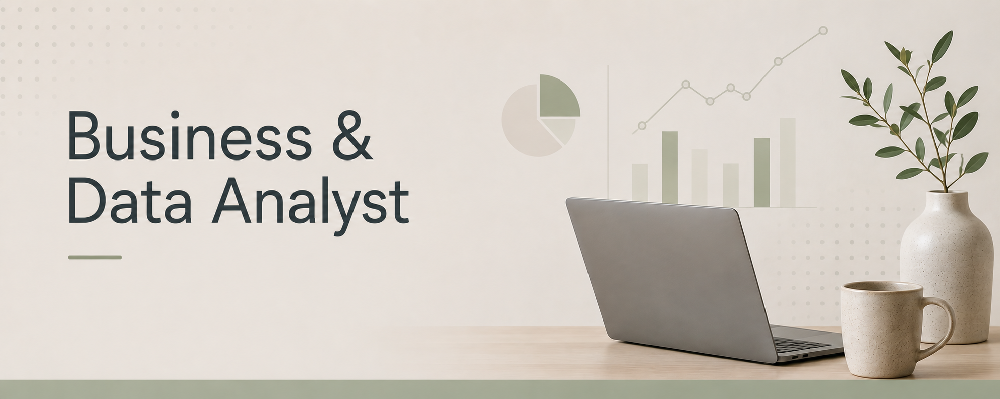

---

## 💼 What I Bring

A portfolio of projects that combine business analysis, data analysis, technology, and operational improvement.

My work includes:

- Data analysis, reporting, and business insights.
- SQL and database analysis.
- Inventory and operations management.
- Power BI and Excel reporting solutions.
- Business requirements and process analysis.
- Background in software testing and software development.

---
## Skills

### Business Analysis

### Data & Reporting

    

### Tools & Technologies

### Quality Assurance

### Development

## Interests

- Remote Business & Data Analyst opportunities
- Business analysis, process improvement, and project management
- Data analysis and business reporting
- Inventory and operations analysis
- Learning and applying new data analysis tools and technologies

---
## 🤝 Let’s Connect

Interested in connecting with professionals and exploring opportunities in Business Analysis, Data Analysis, Operations, and Project Management.
 

## 📍 Find me at
  
 
 
